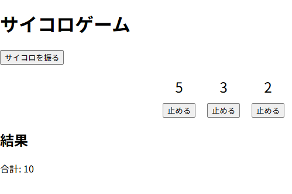

# Step 0: 読みにくいソースコード


## 読みにくいソースコードってなんだ？
<!-- _class: lead invert -->

### 問題提起

そもそも読みにくいソースコードって何だろう？？


### ダイスゲーム



- 画面要素
    - 「サイコロを振る」ボタン
    - 止めるボタン × 3
    - 数字表記 × 3
    - 結果
- 「サイコロを振る」で数字がランダムに動く
- 「止める」で乱数が止まる
- 合計値が出力される

## ソースコードレビュー
<!-- _class: invert -->

### ソースコードを覗いてみる

`learn/sample_project/sample000/dist` を VSCodeで開いてください。

| ファイル名 | 役割 |
| -- | -- |
| `index.css`| 画面要素のレイアウトや色 |
| `index.html` | 画面要素定義 |
| `index.js` | 画面要素の動きの定義 |

### 演習: 読んでみよう

- `index.js` を読んでみよう
- 率直な感想をグループ内で共有してみよう
- 出てきた意見をメモしよう
- 意見を分類して整理しよう


## 振り返り
<!-- _class: invert -->

### 振り返り結果

* 綴りミス (Botton), ローマ字変数 (saikoro, goukei), 英語と日本語の混在
* 不統一な空行, 不統一なスペース,
* 謎コメント
* var の乱用, フラグ乱立, コピペ地獄
* マジックナンバー, どこに何が。。。。？


### 整理すると

| 問題 | 説明 |
| -- | -- |
| 命名規則 | 変数や関数の名前にルールを持たせていないから |
| レイアウト | スペースや空行にルールを持たせていないから |
| コメント | コメントが適切じゃないから |
| 設計の問題 | 設計ができていないから |

<div class="red-box">
今回は、 「設計の問題」に挑みます。
</div>

## 補足資料
<!-- _class: invert -->

### 命名規則

#### 基本原則

変数/プロパティ、関数/メソッド、定数、クラス名などについて、あらかじめ以下のような項目を決めておく

- 言語(日本語/英語)
- ケース (`camelCase`, `PascalCase`, `UPPER_SNAME`, `lower_snake`)
- 品詞 (関数名は 「動詞+名詞」など)

---

#### 良い命名の例

```javascript
const MAX_VALUE = 100;

function calculateAverage(numberArray) {
    let total = 0;
    //....
    return average;
}
```

### コメントルール

#### コードを読めば分かることはコメントしない

コメントは「何をしているか」ではなく「なぜ必要か」を補足するために使います。

```javascript
// 悪い例:
//   iを1増やす
// 良い例:
//  改ページする
i++;
```


#### 処理の目的や意図を書く

「この計算が必要な理由」「この条件分岐の背景」など、コードだけでは分からない意図を説明します。


---

#### 最新のコードとコメントを常に一致させる

古いコメントは誤解の原因になります。コードを修正したらコメントも見直します。


#### 長い処理は適切な単位で説明する

アルゴリズムや複雑な処理の前に、その処理全体の概要を簡潔に記載します。


#### 関数・メソッドには入出力や役割を記載する

「何をする関数か」「引数の意味」「戻り値の内容」を明確にすると理解しやすくなります。