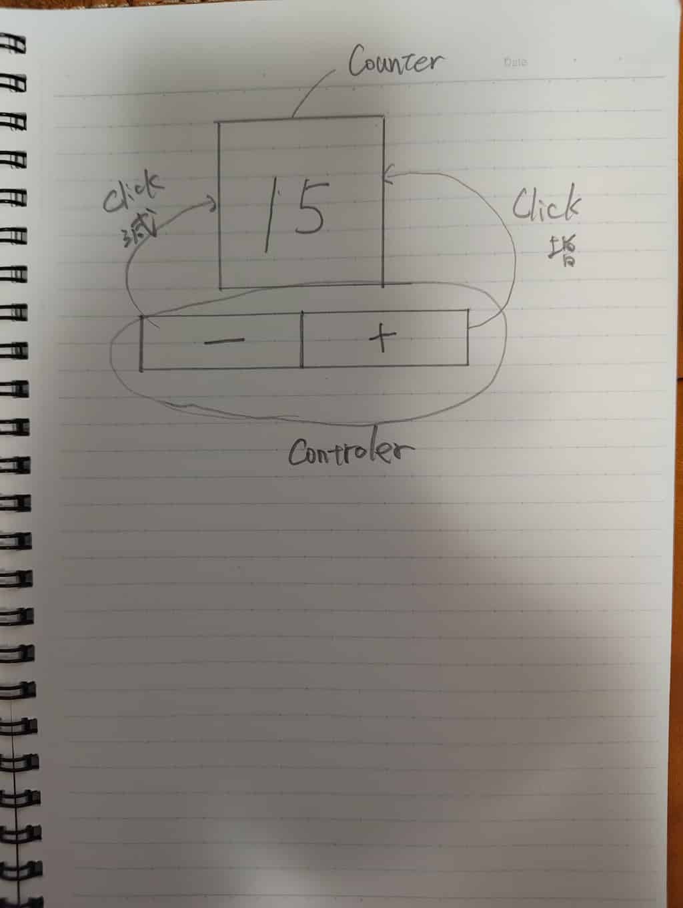

# Step 0: Try to design Apps.

## 設計書を作ってみよう

<!-- _class: lead invert -->

### 全体的な流れ

0. ラフスケッチと要件を描く
1. 部品に分割する
2. 基本設計を書く
3. 部品設計書を書く

## ラフスケッチと要件

### ラフスケッチ

作りたいもののラフスケッチを描こう

### 要件

- アプリケーションの名前
- 概要
- 制約を明確に描く

### 部品に分割する

- ラフスケッチに線を入れて部品に分割します。
- 自動車を想像してください。
- いきなり自動車を作るのは大変ですよね。
- なので、部品に分割して作る感じです。

### 実際ものを見てみよう

#### ファイルの確認
`learn/sample_project/sample001/docs` の中にある。

- `0.concept_memo.jpg`
- `0.requirements.md`

---

#### 中身の確認
- ここでは、`Counter` という部品と `Controller` という部品の二つに分解しています。
- それぞれの部品が「何をしたときに、何をするか」をメモしておきます。
- また、このアプリの要件についてまとめました。
- 以下のようなことがまとめてあります。
    - アプリがどのように使われるか？
    - 何のために作るのか？

### 演習1: 要件をまとめてみる

`learn/learning_project/dice/docs/dice-game.png`が今回作りたいアプリです。

- 動作は前でデモします。
- 演習1-1: どんな部品分割にするかを検討してチームでまとめてください。
- 演習1-2: このアプリにはどんな要件(シナリオ)がありそうかチームで相談してください。
- 演習1-3: `requirements.md` を完成させよう

## 基本設計をまとめる

### 設計の流れ

- いよいよラフスケッチをもとに設計を進めます。
- 「それぞれの部品が「何をしたときに、何をするか」をメモ」したと思います。
- これをもとに設計を始めます。
- 設計は以下の項目を明確にします。
    - 画面がどのような構成要素(部品)で構成されているか？
    - 構成要素の関係性
        - 静的な関係性
        - 動的な関係性

### 静的な関係性と動的な関係性

#### 静的な関係(構造)

- 構造として決まっている関係
- プログラム実行前から分かる関係
- クラスやモジュールの配置・役割を表す
- 継承、親子関係、包含（所有）などが代表例
- 「何が何で構成されるか」を示す

---

#### 動的な関係(ふるまい)

- 実行時に発生する関係
- プログラムの動きによって変化する関係
- モジュール間のやり取りや連携を表す
- メソッド呼び出し、イベント通知、メッセージ送信などが代表例
- 「誰が誰とやり取りするか」を示す

### 実際ものを見てみよう

`learn/sample_project/sample001/docs` の中にある。

- `1.0.basic-design.md`

### 中身の確認

- まず、部品を明確にするために、画面レイアウトと部品構成を書きました。
- 静的な関係を描くために、その部品の階層関係と、モジュール構成を書きました。
- 最後に部品の動的な関係を明らかにするために、呼び出し関連を記述します。

### 演習2: 基本設計をまとめる
