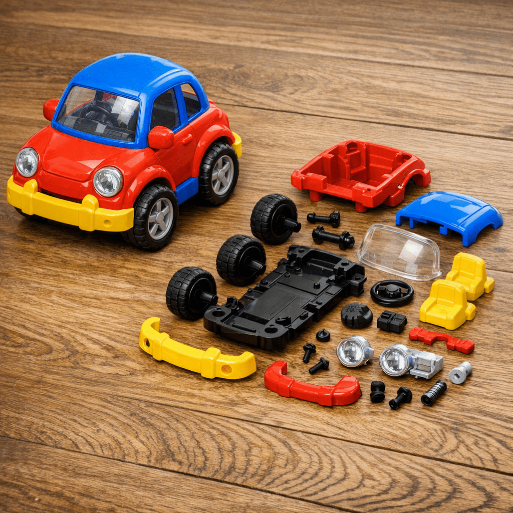

# Step 0: Design Apps.

## 設計書を作ってみよう
<!-- _class: lead invert -->

### 全体的な流れ

1. 部品に分割する
2. 基本設計を書く
3. 部品設計書を書く

## 部品に分割する
<!-- _class: lead invert -->

### 部品に分割する

- ラフスケッチに線を入れて部品に分割します。
- 自動車を想像してください。
- いきなり自動車を作るのは大変ですよね。
- なので、部品に分割して作る感じです。

### 実際ものを見てみよう

#### ファイルの確認
`learn/sample_project/sample001/docs` の中にある。

- `0.concept_memo.jpg`

---

#### 中身の確認

- ここでは、`Counter` という部品と `Controller` という部品の二つに分解しています。
- それぞれの部品が「何をしたときに、何をするか」をメモしておきます。

## 基本設計をまとめる
<!-- _class: lead invert -->

### 設計の流れ

- いよいよラフスケッチをもとに設計を進めます。
- 「それぞれの部品が「何をしたときに、何をするか」をメモ」したと思います。
- これをもとに設計を始めます。
- 設計は以下の項目を明確にします。
    - 画面がどのような構成要素(部品)で構成されているか？
    - 構成要素の関係性
        - 静的な関係性
        - 動的な関係性

### 静的な関係性と動的な関係性

#### 静的な関係(構造)

- 構造として決まっている関係
- プログラム実行前から分かる関係
- クラスやモジュールの配置・役割を表す
- 継承、親子関係、包含（所有）などが代表例
- 「何が何で構成されるか」を示す

---

#### 動的な関係(ふるまい)

- 実行時に発生する関係
- プログラムの動きによって変化する関係
- モジュール間のやり取りや連携を表す
- メソッド呼び出し、イベント通知、メッセージ送信などが代表例
- 「誰が誰とやり取りするか」を示す

### 実際ものを見てみよう

`learn/sample_project/sample001/docs` の中にある。

- `1.basic-design.md`

### 中身の確認

- まず、部品を明確にするために、画面レイアウトと部品構成を書きました。
- 静的な関係を描くために、その部品の「階層関係」と、「モジュール構成」を書きました。
- 最後に部品の動的な関係を明らかにするために、「呼び出し関連」を記述します。

### 演習2: 基本設計をまとめる

`dice` プロジェクトの基本設計書をまとめてみよう
画面レイアウトとして、案A, 案B, 案C を用意しています。これらを確認して話し合いながらどの形にするかをグループで決めてから着手してください。

## 部品設計書をまとめる
<!-- _class: lead invert -->

### 部品設計書に書くべきもの

- 部品の概要(使い方)
- 部品の機能
- 部品のインターフェース
- 部品の作り

これだけのことを書く。

### 誰が読む？

#### 部品を使う人

- 部品の概要(使い方)
- 部品の機能
- 部品のインターフェース

#### 部品を作る人

- 部品のインターフェース
- 部品の作り

### 実際ものを見てみよう

`learn/sample_project/sample001/docs` の中にある。

- `2.1.parts-design-eventhandler.md`
- `2.2.parts-design-counter.md`
- `2.1.parts-design-controller.md`

### 中身の確認

- 章構成をまずはみる。
- 自分が使う人の気持ちで見てみる。
- 自分が作る人の気持ちで見てみる。

ここまでくると、動作するものは作っていけそう？？

### 演習3: 部品設計をまとめる

`dice` プロジェクトの StartStopButtonの部品設計書を作成してみよう