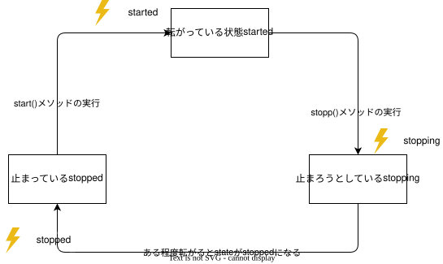
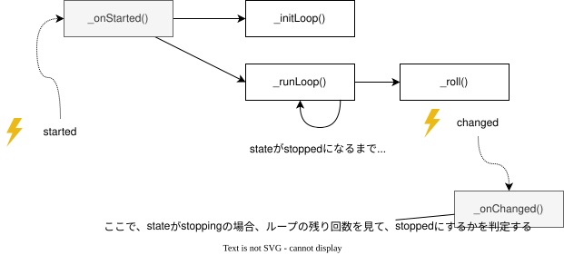

# `Dice` クラス

さいころの目を表すクラス

## 機能概要

- さいころの目を取得する
    - `value` プロパティ
- さいころの開始と停止
    - `start()`/`stop()`メソッド
- さいころ状態の参照とイベント
    - `state` プロパティ/ `stated`イベント/`stopping`イベント/`stopped`イベント
- 値更新イベント
    - `changed`イベント

#### 状態遷移図



---

## インタフェース

### `constructor(elementId)`

- `elementId` で指定されるDOM要素をさいころとしてインスタンスを生成する。

### プロパティ

| プロパティ名 | 概要           | `set` | `get` |
| ------------ | -------------- | ----- | ----- |
| `value`      | さいころの目値 | 〇    | 〇    |
| `state`      | さいころの状態 | ×     | 〇    |

`sate` は `ROLLING_STATE` を使って判定する。

```javascript
if (dice.state === ROLLING_STATE.started) {
    // 転がっている状態
} else if (dice.state === ROLLING_STATE.stopping) {
    // 停止しようとゆっくり転がっている状態
} else if (dice.state === ROLLING_STATE.stopped) {
    // 完全に停止している状態
}
```

### メソッド

| メソッド名 | 引数 | 概要             |
| ---------- | ---- | ---------------- |
| `start()`  | なし | スタートさせる　 |
| `stop()`   | なし | 停止させる       |

### イベント

| イベント名 | イベント                       | 引数             |
| ---------- | ------------------------------ | ---------------- |
| `started`  | 転がり始めた                   | このオブジェクト |
| `stopping` | 止まろうとゆっくり転がり始めた | このオブジェクト |
| `stopped`  | 止まった                       | このオブジェクト |
| `changed`  | 値が変わった                   | このオブジェクト |

---

## 処理明細

### コールグラフとクラスのアーキテクチャ



さいころの目の動きは、`_onStarted()` と `_onChange()`の二つのイベントハンドラが重要な役割を果たす。

#### さいころの開始の流れ

- このクラスの呼び元は、`start()`メソッドを呼び出す。この時 `started`イベントが発火し`_onStarted()`メソッドが実行される
- `_onStarted()`メソッドは、ループの準備(`_initLoop()`)を実行し、その後ループを実行する(`_runLoop()`)
- `_runLoop()`は状態(`state`)を見て継続が必要な場合は、さいころの目を変更して、時間(`_interval`)をおいてから `_runLoop()` を呼び出す。
- また、さいころの目が変更されると `change`イベントが発火して、 `_onChange()`イベントが実行される。

#### 停止の流れ

- `stopped()`メソッドでは、直接 `stopped` には遷移せずに、`stopping`に状態を変更しておく
- `_onChnage()`イベントでは、状態が `stopping` のとき、ループ必要回数をカウントして、残り回数が0になると `stopped` に変更する。
- `_runLoop()`で、状態を見て自身を呼ぶべきか判定しているので、結果ループが止まる。
